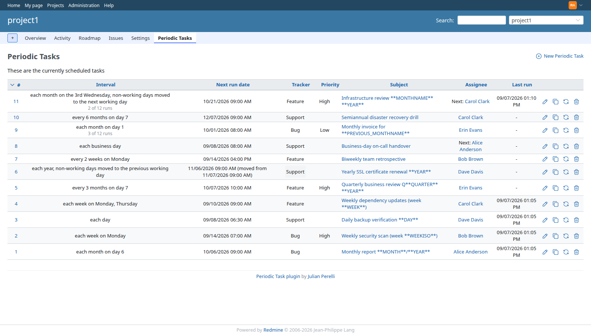
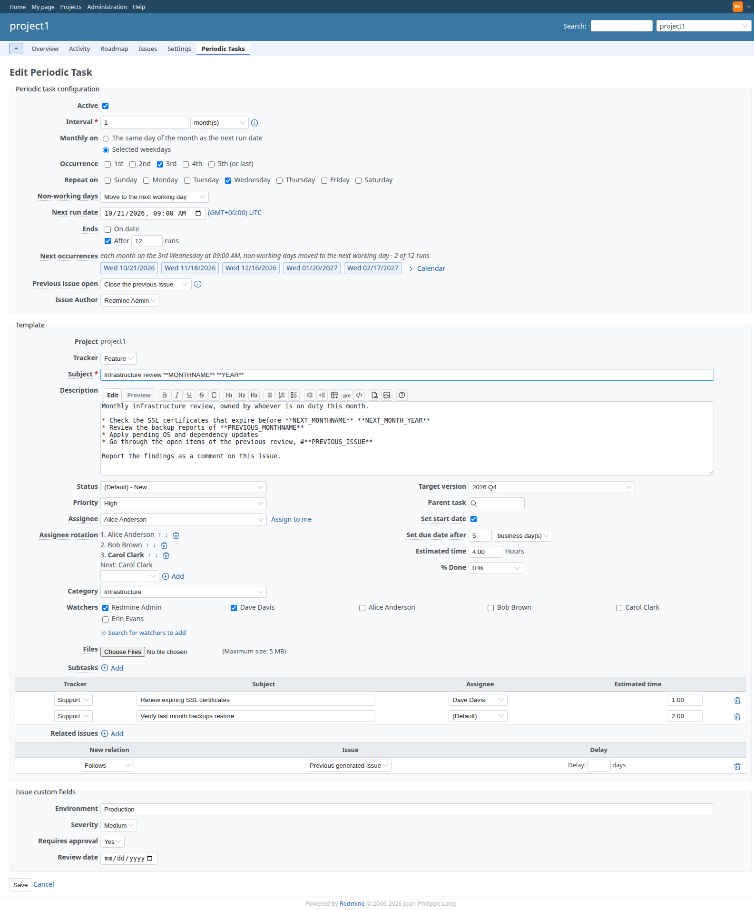
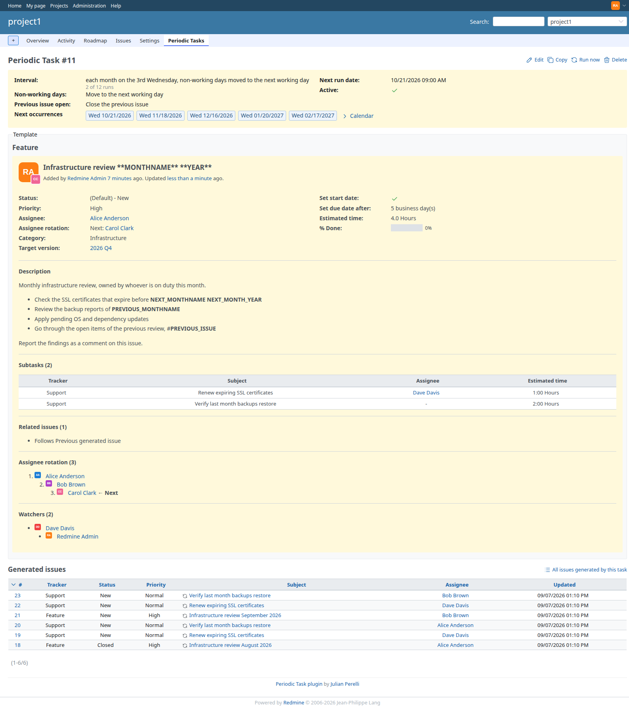
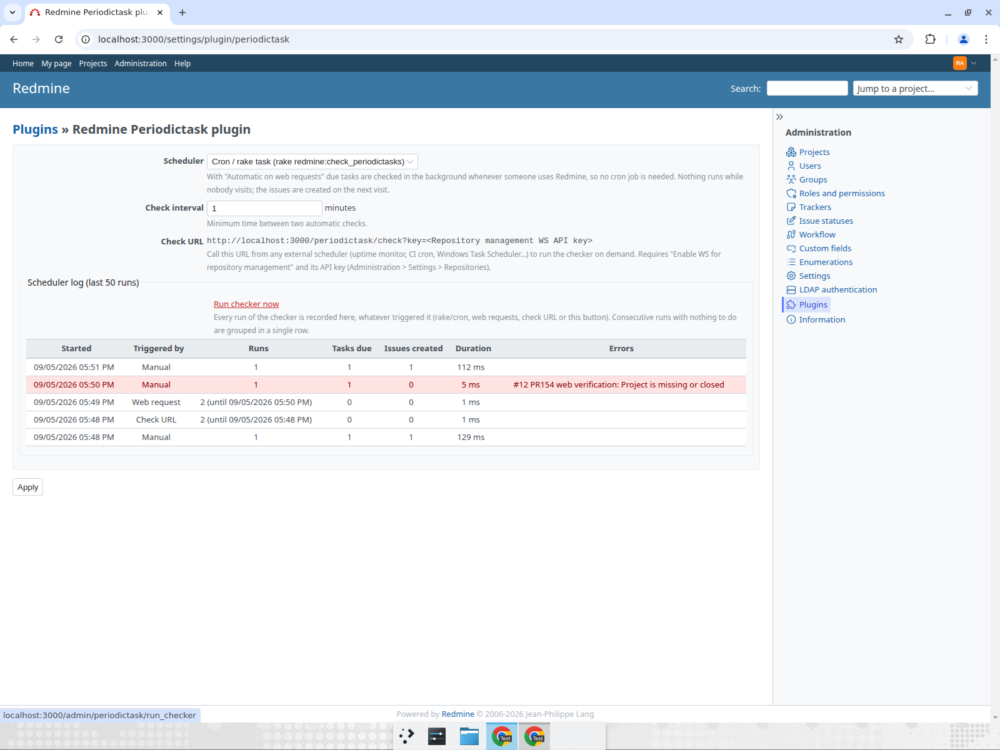

# Redmine periodictask 

In some projects there are tasks that need to be assigned on a schedule. Such as check the ssl registration once per year or run security checks every 3 months

> Read more about the plugin, how it works internally and its history in [this blog post](https://jperelli.com.ar/project/2026/06/29/redmine-periodic-task/).

After you installed the plugin you can add it as a module to a project that already exists or activate it as default module for new projects. On each project it will add a new tab named "Periodic Task" - just go there to add your tasks.

## Screenshots

List of scheduled tasks for a project, showing interval, next run date and last run:

Creating or editing a periodic task - it mirrors Redmine's own issue form (tracker, priority, watchers, custom fields, ...):

Task detail page with the history of issues generated from it:

## Redmine version support

Support for old redmine versions has been dropped.
If you are using an old version, you can use the corresponding branch according to the following table.
If you cannot migrate to a newer version and still need support, you can hire me to do it. Just contact me with the details.

<table>
  <tr>
    <td rowspan="2">git branch</td>
    <td colspan="9">redmine version support</td>
  </tr>
  <tr>
    <td>1.x</td>
    <td>2.x</td>
    <td>3.x</td>
    <td>4.x</td>
    <td>5.0</td>
    <td>5.1</td>
    <td>6.0</td>
    <td>6.1</td>
    <td>7.0</td>
  </tr>
  <tr>
    <td>main</td>
    <td>?</td>
    <td>?</td>
    <td>?</td>
    <td>?</td>
    <td>?</td>
    <td>✅</td>
    <td>✅</td>
    <td>✅</td>
    <td>✅</td>
  </tr>
  <tr>
    <td>redmine4</td>
    <td>?</td>
    <td>?</td>
    <td>✅</td>
    <td>✅</td>
    <td>🚫</td>
    <td>🚫</td>
    <td>🚫</td>
    <td>🚫</td>
    <td>🚫</td>
  </tr>
  <tr>
    <td>redmine2</td>
    <td>✅</td>
    <td>✅</td>
    <td>🚫</td>
    <td>🚫</td>
    <td>🚫</td>
    <td>🚫</td>
    <td>🚫</td>
    <td>🚫</td>
    <td>🚫</td>
  </tr>
</table>

To use redmine2 branch, when cloning use `-b redmine2` like this `git clone -b redmine2 https://github.com/jperelli/Redmine-Periodic-Task.git plugins/periodictask`

## Installation

Run these from your Redmine root (paths below assume `/opt/redmine` — adjust to yours):

    cd /opt/redmine
    git clone https://github.com/jperelli/Redmine-Periodic-Task.git plugins/periodictask
    bundle install
    bundle exec rake redmine:plugins:migrate NAME=periodictask RAILS_ENV=production

Then restart Redmine so it picks up the plugin (see [Restarting Redmine](#restarting-redmine)).

## Upgrade

    cd /opt/redmine/plugins/periodictask
    git pull
    bundle install
    bundle exec rake redmine:plugins:migrate NAME=periodictask RAILS_ENV=production

Then restart Redmine (see [Restarting Redmine](#restarting-redmine)).

## Uninstallation

    cd /opt/redmine
    bundle exec rake redmine:plugins:migrate NAME=periodictask VERSION=0 RAILS_ENV=production
    rm -rf plugins/periodictask

Then restart Redmine (see [Restarting Redmine](#restarting-redmine)).

### Restarting Redmine

How you reload Redmine depends on how it's served:

- **Puma / Unicorn under systemd:** `sudo systemctl restart redmine`
- **Passenger (Apache or nginx):** `touch /opt/redmine/tmp/restart.txt`
- **Docker:** `docker compose restart redmine`

## Configuration

Something has to periodically check which tasks are due and create their issues. Pick one of:

| Mode | Needs | Timing | Best for |
|---|---|---|---|
| [Cron](#option-a-cron-default) (default) | shell access to the server, cron | exact | classic Linux installs |
| [Automatic on web requests](#option-b-automatic-on-web-requests-no-cron) | nothing | on the first visit after a task is due | Windows, Docker, shared hosting, anyone who can't or doesn't want to set up cron |
| [Check URL](#option-c-check-url-external-scheduler) | an external scheduler that can call a URL | as exact as the external scheduler | punctual runs without cron on the Redmine host |

The modes can be combined; running the checker more than once is harmless, a task is only generated when its next run date has passed.

### Option A: cron (default)

Periodic tasks are created by a rake task that you run from cron. Cron has a minimal `PATH`, so use the absolute path to `bundle`. Find it with `which bundle` (e.g. with rbenv it's something like `/home/redmine/.rbenv/shims/bundle`, with a system Ruby `/usr/local/bin/bundle`).

Edit the crontab of the user that owns your Redmine install (`crontab -e`) and add one of the following. Replace `/opt/redmine` with your Redmine root and `/usr/local/bin/bundle` with the path from `which bundle`.

Once a day, at 01:00:

    0 1 * * * cd /opt/redmine && /usr/local/bin/bundle exec rake redmine:check_periodictasks RAILS_ENV=production

Once per hour:

    0 * * * * cd /opt/redmine && /usr/local/bin/bundle exec rake redmine:check_periodictasks RAILS_ENV=production

Every 10 minutes:

    */10 * * * * cd /opt/redmine && /usr/local/bin/bundle exec rake redmine:check_periodictasks RAILS_ENV=production

### Option B: automatic on web requests (no cron)

Go to *Administration → Plugins → Redmine Periodictask plugin → Configure* and set **Scheduler** to *Automatic on web requests*. From then on every request to Redmine (any page, any user, including the API) checks whether the configured **Check interval** (default 5 minutes) has elapsed since the last check and, if so, runs the checker in a background thread of the web process, so the request itself is not slowed down. A row in `periodictask_scheduler_locks` makes sure only one process runs the check per interval even with several Puma/Passenger workers or several application servers.

Things to know:

- Nothing happens while nobody uses Redmine. Issues due on Saturday are created on the first visit on Monday morning; their start/due dates are still computed from the scheduled date, see [doc/recurrence-design.md](doc/recurrence-design.md) for how late runs are handled.
- Issues are created with Redmine's default language (the `LOCALE` variable below only applies to the rake task).
- You can still run the rake task manually or from cron at the same time.

### Option C: check URL (external scheduler)

The plugin exposes `GET|POST /periodictask/check?key=<API key>`, which runs the checker immediately and answers `Periodictask: N task(s) run`. It is protected like Redmine's own `/sys` endpoints: enable *Administration → Settings → Repositories → Enable WS for repository management* and use the API key shown there. The full URL is also shown in the plugin configuration page.

Call it from whatever scheduler you have, for example:

- an uptime monitor (UptimeRobot, healthchecks.io, ...) pinging the URL every 5 minutes
- a GitHub Actions / GitLab CI scheduled workflow running `curl -fsS "https://redmine.example.com/periodictask/check?key=..."`
- Windows Task Scheduler running `curl.exe -fsS "https://redmine.example.com/periodictask/check?key=..."`
- a Kubernetes `CronJob` with a `curlimages/curl` container

The endpoint works regardless of the **Scheduler** setting.

### Scheduler log

The plugin configuration page (*Administration → Plugins → Redmine periodictask → Configure*) shows the last 50 runs of the checker, whatever triggered them (cron/rake, web request, check URL or the *Run checker now* button): when it started, how many tasks were due, how many issues were created, how long it took and any errors. Use it to confirm that your cron/uptime monitor/CI schedule is actually firing. Consecutive runs that found nothing to do are grouped in a single row (with a run counter and the time of the last one), so the 50 rows cover days of history even with a 5-minute web-request interval.

The *Run checker now* button on the same page runs the checker immediately, which is handy to test a setup without waiting for the scheduler.

### Recurrence

A task repeats every N days, business days, weeks, months or years. A weekly task can also run on several weekdays. A monthly task can run on a day of the month, or on the 1st to 5th (or last) occurrence of one or more weekdays, for example the 3rd Wednesday of every month. [doc/recurrence-design.md](doc/recurrence-design.md) explains how the next run date is calculated, what happens with time zones and missing weekdays, and what happens after the scheduler was down.

### Variable interpolation

You can use the following variables in the subject and description of a periodic task. They will be replaced with the corresponding value when the issue is created.

| Variable | Description |
|---|---|
| `**DAY**` | Day of the month, zero-padded (01..31) |
| `**WEEK**` | Week number of the year, starting with the first Monday as the first day of the first week (00..53) |
| `**WEEKISO**` | ISO 8601 week number of the year (01..53) |
| `**MONTH**` | Month of the year, zero-padded (01..12) |
| `**MONTHNAME**` | Full month name (e.g. January), localized |
| `**QUARTER**` | Quarter of the year (1..4) |
| `**YEAR**` | Four-digit year |
| `**PREVIOUS_MONTH**` | Previous month, zero-padded (01..12) |
| `**PREVIOUS_MONTHNAME**` | Full name of the previous month, localized |

If you want to get localized month names, please add `LOCALE="de"` (available are `bg`, `de`, `en`, `es`, `hr`, `it`, `ja`, `pl`, `pt-BR`, `ru`, `tr`, `uk`, `vi`, `zh`) to the cronjob like this

    0 * * * * cd /opt/redmine && /usr/local/bin/bundle exec rake redmine:check_periodictasks RAILS_ENV=production LOCALE="de"

## Plugins supported

redmine-periodictask supports [redminecrm checklist PRO](https://www.redmineup.com/pages/plugins/checklists) to be used when creating a periodic task.

## Development

Start with `docker compose up --build` and wait until it finishes.
In other console do `./provision.sh`, this will install initial data for it to be easier to develop.

Then go to http://127.0.0.1:3000/ and login with

    user: admin
    pass: admin

You should have a project named *project1* with `periodictask` installed

In order to run the "cron checker": `docker compose exec redmine bundle exec rake redmine:check_periodictasks RAILS_ENV=development`, or enable *Automatic on web requests* in the plugin configuration and reload any page.

## Authors

  - [Julian Perelli](https://jperelli.com.ar/) (Current Maintainer)
  - [Tanguy de Courson](https://github.com/myneid/) (Original Author)

## Top Contributors

 - [yzzy](https://github.com/yzzy)
 - [s-andy](https://github.com/s-andy)
 - [tuzumkuru](https://github.com/tuzumkuru) redmine v6 support

## License

MIT
