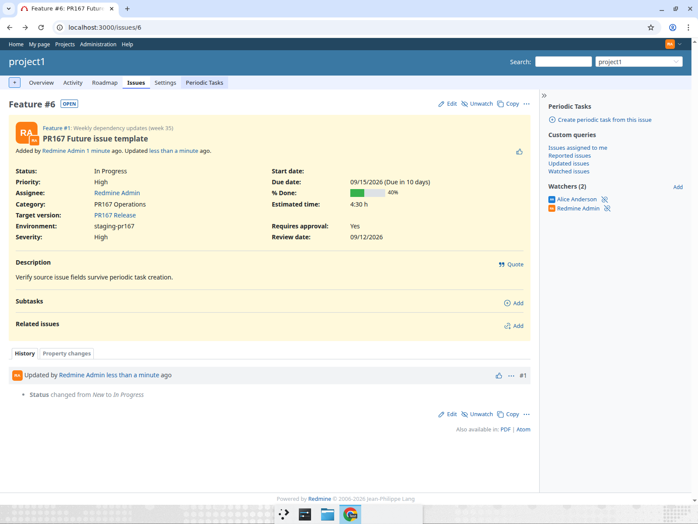
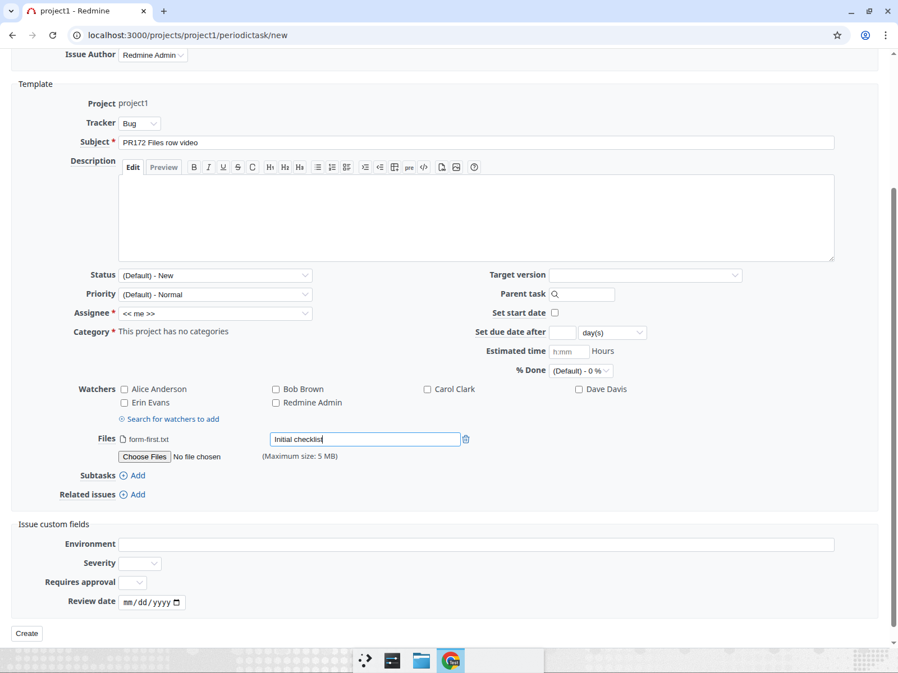

<p align="center"></p>

# Redmine periodictask [](https://github.com/jperelli/Redmine-Periodic-Task/actions/workflows/test.yml)

In some projects there are tasks that need to be assigned on a schedule. Such as check the ssl registration once per year or run security checks every 3 months

> Read more about the plugin, how it works internally and its history in [this blog post](https://jperelli.com.ar/project/2026/06/29/redmine-periodic-task/).

After you installed the plugin you can add it as a module to a project that already exists or activate it as default module for new projects. On each project it will add a new tab named "Periodic Task" - just go there to add your tasks.

## Screenshots

List of scheduled tasks for a project, showing interval, next run date and last run:


Creating or editing a periodic task - it mirrors Redmine's own issue form (tracker, priority, watchers, custom fields, ...):


Task detail page with the history of issues generated from it:


## Redmine version support

Support for old redmine versions has been dropped.
If you are using an old version, you can use the corresponding branch according to the following table.
If you cannot migrate to a newer version and still need support, you can hire me to do it. Just contact me with the details.

<table>
  <tr>
    <td rowspan="2">git branch</td>
    <td colspan="9">redmine version support</td>
  </tr>
  <tr>
    <td>1.x</td>
    <td>2.x</td>
    <td>3.x</td>
    <td>4.x</td>
    <td>5.0</td>
    <td>5.1</td>
    <td>6.0</td>
    <td>6.1</td>
    <td>7.0</td>
  </tr>
  <tr>
    <td>main</td>
    <td>?</td>
    <td>?</td>
    <td>?</td>
    <td>?</td>
    <td>?</td>
    <td>✅</td>
    <td>✅</td>
    <td>✅</td>
    <td>✅</td>
  </tr>
  <tr>
    <td>redmine4</td>
    <td>?</td>
    <td>?</td>
    <td>✅</td>
    <td>✅</td>
    <td>🚫</td>
    <td>🚫</td>
    <td>🚫</td>
    <td>🚫</td>
    <td>🚫</td>
  </tr>
  <tr>
    <td>redmine2</td>
    <td>✅</td>
    <td>✅</td>
    <td>🚫</td>
    <td>🚫</td>
    <td>🚫</td>
    <td>🚫</td>
    <td>🚫</td>
    <td>🚫</td>
    <td>🚫</td>
  </tr>
</table>

To use redmine2 branch, when cloning use `-b redmine2` like this `git clone -b redmine2 https://github.com/jperelli/Redmine-Periodic-Task.git plugins/periodictask`

## Installation

Run these from your Redmine root (paths below assume `/opt/redmine` — adjust to yours):

    cd /opt/redmine
    git clone https://github.com/jperelli/Redmine-Periodic-Task.git plugins/periodictask
    bundle install
    bundle exec rake redmine:plugins:migrate NAME=periodictask RAILS_ENV=production

Then restart Redmine so it picks up the plugin (see [Restarting Redmine](#restarting-redmine)).

## Upgrade

    cd /opt/redmine/plugins/periodictask
    git pull
    bundle install
    bundle exec rake redmine:plugins:migrate NAME=periodictask RAILS_ENV=production

Then restart Redmine (see [Restarting Redmine](#restarting-redmine)).

## Uninstallation

    cd /opt/redmine
    bundle exec rake redmine:plugins:migrate NAME=periodictask VERSION=0 RAILS_ENV=production
    rm -rf plugins/periodictask

Then restart Redmine (see [Restarting Redmine](#restarting-redmine)).

### Restarting Redmine

How you reload Redmine depends on how it's served:

- **Puma / Unicorn under systemd:** `sudo systemctl restart redmine`
- **Passenger (Apache or nginx):** `touch /opt/redmine/tmp/restart.txt`
- **Docker:** `docker compose restart redmine`

## Configuration

Something has to periodically check which tasks are due and create their issues. Pick one of:

| Mode | Needs | Timing | Best for |
|---|---|---|---|
| [Cron](#option-a-cron-default) (default) | shell access to the server, cron | exact | classic Linux installs |
| [Automatic on web requests](#option-b-automatic-on-web-requests-no-cron) | nothing | on the first visit after a task is due | Windows, Docker, shared hosting, anyone who can't or doesn't want to set up cron |
| [Check URL](#option-c-check-url-external-scheduler) | an external scheduler that can call a URL | as exact as the external scheduler | punctual runs without cron on the Redmine host |

The modes can be combined; running the checker more than once is harmless, a task is only generated when its next run date has passed.

### Option A: cron (default)

Periodic tasks are created by a rake task that you run from cron. Cron has a minimal `PATH`, so use the absolute path to `bundle`. Find it with `which bundle` (e.g. with rbenv it's something like `/home/redmine/.rbenv/shims/bundle`, with a system Ruby `/usr/local/bin/bundle`).

Edit the crontab of the user that owns your Redmine install (`crontab -e`) and add one of the following. Replace `/opt/redmine` with your Redmine root and `/usr/local/bin/bundle` with the path from `which bundle`.

Once a day, at 01:00:

    0 1 * * * cd /opt/redmine && /usr/local/bin/bundle exec rake redmine:check_periodictasks RAILS_ENV=production

Once per hour:

    0 * * * * cd /opt/redmine && /usr/local/bin/bundle exec rake redmine:check_periodictasks RAILS_ENV=production

Every 10 minutes:

    */10 * * * * cd /opt/redmine && /usr/local/bin/bundle exec rake redmine:check_periodictasks RAILS_ENV=production

### Option B: automatic on web requests (no cron)

Go to *Administration → Plugins → Redmine Periodictask plugin → Configure* and set **Scheduler** to *Automatic on web requests*. From then on every request to Redmine (any page, any user, including the API) checks whether the configured **Check interval** (default 5 minutes) has elapsed since the last check and, if so, runs the checker in a background thread of the web process, so the request itself is not slowed down. A row in `periodictask_scheduler_locks` makes sure only one process runs the check per interval even with several Puma/Passenger workers or several application servers.

Things to know:

- Nothing happens while nobody uses Redmine. Issues due on Saturday are created on the first visit on Monday morning; their start/due dates are still computed from the scheduled date, see [doc/recurrence-design.md](doc/recurrence-design.md) for how late runs are handled.
- Issues are created with Redmine's default language (the `LOCALE` variable below only applies to the rake task).
- You can still run the rake task manually or from cron at the same time.

### Option C: check URL (external scheduler)

The plugin exposes `GET|POST /periodictask/check?key=<API key>`, which runs the checker immediately and answers `Periodictask: N task(s) run`. It is protected like Redmine's own `/sys` endpoints: enable *Administration → Settings → Repositories → Enable WS for repository management* and use the API key shown there. The full URL is also shown in the plugin configuration page.

Call it from whatever scheduler you have, for example:

- an uptime monitor (UptimeRobot, healthchecks.io, ...) pinging the URL every 5 minutes
- a GitHub Actions / GitLab CI scheduled workflow running `curl -fsS "https://redmine.example.com/periodictask/check?key=..."`
- Windows Task Scheduler running `curl.exe -fsS "https://redmine.example.com/periodictask/check?key=..."`
- a Kubernetes `CronJob` with a `curlimages/curl` container

The endpoint works regardless of the **Scheduler** setting.

### Scheduler log

The plugin configuration page (*Administration → Plugins → Redmine periodictask → Configure*) shows the last 50 runs of the checker, whatever triggered them (cron/rake, web request, check URL or the *Run checker now* button): when it started, how many tasks were due, how many issues were created, how long it took, any errors, and notes about tasks that deliberately created nothing (see [Previous issue open](#previous-issue-open)). Use it to confirm that your cron/uptime monitor/CI schedule is actually firing. Consecutive runs that found nothing to do (or only skipped or waited for the same tasks) are grouped in a single row (with a run counter and the time of the last one), so the 50 rows cover days of history even with a 5-minute web-request interval.

The *Run checker now* button on the same page runs the checker immediately, which is handy to test a setup without waiting for the scheduler.

*Administration → Periodic Tasks* lists the tasks of every project in one table (inactive and ended tasks are greyed out, tasks whose last run failed are marked), with links to each task's detail and edit pages.


### Creating a periodic task from an existing issue

On an issue page, the sidebar of a project with the module enabled shows *Periodic Tasks → Create periodic task from this issue* to users with the *Periodic tasks* permission. It opens the new task form prefilled from the issue (subject, description, tracker, priority, category, target version, assignee, parent, estimated hours, % done, custom fields, watchers, and tags/checklist template when those plugins are installed); the status is left at the tracker's default since the source issue is often closed. The recurrence keeps its defaults, and the first run is preset to the issue's due date when that is still in the future. Nothing is stored until the form is submitted.



### Recurrence

A task repeats every N days, business days, weeks, months or years. A weekly task can also run on several weekdays. A monthly task can run on a day of the month, or on the 1st to 5th (or last) occurrence of one or more weekdays, for example the 3rd Wednesday of every month. [doc/recurrence-design.md](doc/recurrence-design.md) explains how the next run date is calculated, what happens with time zones and missing weekdays, and what happens after the scheduler was down.

### End condition

By default a task repeats forever. The `Ends` control of the form can stop it *on a date* and/or *after N runs*; when both are set, whichever comes first applies. Once the scheduler creates a run and the next one would fall after the end date, or the number of scheduled runs reaches N, the task's state becomes *Ended* and an entry such as *Periodic task ended (maximum number of runs reached)* is written to the project activity. The task lists and detail page show `Ends on <date>` and `<n> of <max> runs` next to the schedule. `Run now` does not count towards N, nor does an occurrence skipped because the previous issue was still open (see [Previous issue open](#previous-issue-open)). Set the state back to *Active* (after moving the end date or raising N) to resume the task; the copy action keeps the end condition, starts the count at 0 and starts active.

### State

Each task is *Active*, *Inactive* or *Ended*. *Active* tasks are picked up by the scheduler. *Inactive* is a pause you set yourself in the form to stop a task without deleting it. *Ended* is set by the scheduler when the end condition is reached; the detail page shows *Ended on <date>*. Inactive and ended tasks are skipped by the scheduler but keep their schedule and can still be run with `Run now`. In the task lists inactive tasks are greyed out and ended tasks are greyed out and struck through, like closed issues.

### Previous issue open

By default a task creates a new issue on every occurrence, even when nobody closed the one from the previous occurrence, so unfinished issues pile up (a weekly report nobody writes). The *Previous issue open* setting of each task decides what a due run does when the issue it generated last time is not closed yet:

| Mode | What happens while the previous issue is open | Schedule |
|---|---|---|
| **Create a new issue anyway** (default) | A new issue is created; the old one stays open. | Unchanged. |
| **Skip this occurrence** | Nothing is created. The task detail page shows *The run of … did not create an issue: #123 was still open* above the generated issues, and the scheduler log records `skipped: #123 is still open` in its *Notes* column. It is not an error, so *Last error* stays empty. | The next run date moves on to the next occurrence: the skipped one is lost. |
| **Close the previous issue** | The previous issue (and the subtasks the task generated under it) is closed with the first closed status its workflow allows the task author, with a journal note pointing at the new issue, and the new issue is created. If Redmine refuses to close it (blocked by another issue, open subtasks that the task did not create, no closed status) the new issue is still created and the failure is shown in *Last error* and in the scheduler log. | Unchanged. |
| **Wait until it is closed** | Nothing is created and the next run date is not advanced: the task stays due. Once the issue is closed, the schedule restarts from its closing day: the next run is the first occurrence after that day at the task's usual time (closed on Monday 15:37, daily at 10:00 → Tuesday 10:00; closed on a Friday, weekly on Wednesdays → next Wednesday; every 2 weeks → two weeks after the closing day). If that is already in the past, the issue is created right away. | Anchored to the closing date instead of the fixed calendar, like Todoist's `every!`. |

The setting is copied by the *Copy* action and shown on the task detail page. *Run now* ignores it and always creates an issue. "Previous issue" means the newest top-level issue the task generated (generated subtasks do not count); an issue deleted from Redmine is ignored. [doc/if-previous-open.md](doc/if-previous-open.md) (also linked from the help icon next to the setting) explains each mode with examples.

### Attachments

A periodic task can carry files (a checklist PDF, a form, a template spreadsheet...): the task form has Redmine's standard *Files* field, and the detail page lists the attached files with the usual download and delete links. Every issue the task generates gets its own copy of each file, with the same author and description, so deleting a file on a generated issue never touches the template (nor the copies on other issues). Copying a task offers to copy its attachments onto the new task, and deleting a task deletes its attachments. A file that cannot be copied (for example because it is missing from the file system) does not prevent the issue from being created; the failure is shown in the task's *Last error*. Viewing, adding and deleting files is governed by the *Periodic tasks* permission of the project.



### Assignee

The assignee of a task is optional. When it is left blank, each generated issue follows Redmine's own default assignee rules: the default assignee of the issue category if it has one, otherwise the project's default assignee, otherwise the issue stays unassigned.

### Finding the generated issues

Issues created by a periodic task are marked with a recurrence icon next to their subject in the issue list, and the issue page says which task created them. The issue list also gets a *Periodic task* filter (*any* / *none* / *is* one of the project's tasks, including subprojects; every task you may manage on the global list) and an optional *Periodic task* column showing the task's subject linked to its page, which can be sorted and grouped like any other column. Both work in saved queries and in the REST API: `GET /issues.json?periodictask=3` returns the issues generated by task #3, `periodictask=*` those generated by any task and `periodictask=!*` the ones created by hand. The task detail page links to the issue list with the filter preset (*All issues generated by this task*).

### Variable interpolation

You can use the following variables in the subject and description of a periodic task. They will be replaced with the corresponding value when the issue is created.

| Variable | Description |
|---|---|
| `**DAY**` | Day of the month, zero-padded (01..31) |
| `**WEEK**` | Week number of the year, starting with the first Monday as the first day of the first week (00..53) |
| `**NEXT_WEEK**` | Same as `**WEEK**` for next week (00..53) |
| `**WEEKISO**` | ISO 8601 week number of the year (01..53) |
| `**NEXT_WEEKISO**` | Same as `**WEEKISO**` for next week (01..53) |
| `**MONTH**` | Month of the year, zero-padded (01..12) |
| `**PREVIOUS_MONTH**` | Previous month, zero-padded (01..12) |
| `**NEXT_MONTH**` | Next month, zero-padded (01..12) |
| `**MONTHNAME**` | Full month name (e.g. January), localized |
| `**PREVIOUS_MONTHNAME**` | Full name of the previous month, localized |
| `**NEXT_MONTHNAME**` | Full name of the next month, localized |
| `**QUARTER**` | Quarter of the year (1..4) |
| `**YEAR**` | Four-digit year |
| `**WEEKISO_YEAR**` | ISO 8601 week-based year of `**WEEKISO**` |
| `**NEXT_WEEK_YEAR**` | Four-digit year of `**NEXT_WEEK**` |
| `**NEXT_WEEKISO_YEAR**` | ISO 8601 week-based year of `**NEXT_WEEKISO**` |
| `**PREVIOUS_MONTH_YEAR**` | Four-digit year of `**PREVIOUS_MONTH**` |
| `**NEXT_MONTH_YEAR**` | Four-digit year of `**NEXT_MONTH**` |
| `**PREVIOUS_ISSUE**` | `#<id>` of the issue created by the previous run of the same task (e.g. `#1234`), empty on the first run |

Each shifted macro has its own year companion, and `**WEEKISO**` has a week-based one, because the year of the
shifted instant is not always the year of the run: pairing `**PREVIOUS_MONTH**` with `**YEAR**` yields `12/2026`
when it runs in January 2026, and an ISO week number belongs to the ISO week-based year, which differs from the
calendar year around New Year (2025-12-29 is already ISO week 01 of 2026).

`**DAY**`, `**WEEK**`, `**WEEKISO**`, `**MONTH**`, `**MONTHNAME**`, `**QUARTER**` and `**YEAR**` also accept a day offset, written as `+N` or `-N` before the closing `**` (N up to 9999): `**DAY-1**` is the day of the month of the day before the issue is created, `**MONTHNAME+10**` the month name ten days later. The shifted macros above take no offset.

The offset shifts the whole date, so combining the variables keeps them consistent across month and year boundaries — on 2027-01-01, `**DAY-1**/**MONTH-1**/**YEAR-1**` renders `31/12/2026`.

`**PREVIOUS_ISSUE**` is not a date: it renders the number of the issue the same task created on its previous run, so `Weekly report (previous: **PREVIOUS_ISSUE**)` gives Redmine's usual `#1234` link back to last week's report, and `Previous report: ` with nothing after it on the first run. `**PREVIOUS_ISSUE-N**` goes back N runs (`**PREVIOUS_ISSUE-2**` is the one before the previous). Issues that have been deleted are skipped; subtasks created by the task are not counted.

If you want to get localized month names, please add `LOCALE="de"` (available are `bg`, `de`, `en`, `es`, `hr`, `it`, `ja`, `pl`, `pt-BR`, `ru`, `tr`, `uk`, `vi`, `zh`, `zh-TW`) to the cronjob like this

    0 * * * * cd /opt/redmine && /usr/local/bin/bundle exec rake redmine:check_periodictasks RAILS_ENV=production LOCALE="de"

### Subtasks and relations

A task can create child issues under each generated issue (their subjects accept the same variables) and relations from the generated issue to other issues, with any relation type Redmine supports (`relates`, `follows`, `precedes`, `blocks`, `duplicates`, `copied_to`, ...) and a delay for `precedes`/`follows`. The target of a relation is either a fixed issue number or *Previous generated issue*: the issue the same task created on its previous run. That way each weekly report can `follow` or `relate to` the one before, so users can walk the chain from Redmine's issue page. On the first run there is no previous issue and the relation is silently skipped; a deleted previous issue is skipped in favour of the one created before it.

## REST API

Periodic tasks can be listed, created, updated, deleted and run through Redmine's REST API, in JSON or XML, following the same conventions as the core API (`/issues.json`, ...). Enable *Administration → Settings → API → Enable REST web service* and authenticate with an API key (`X-Redmine-API-Key` header or `key=` parameter) or HTTP basic auth. The user needs the *Periodic tasks* permission in the project and the *Periodic tasks* module must be enabled, exactly like the HTML pages.

| Method | Path | Description |
|---|---|---|
| `GET` | `/projects/:project_id/periodictask.json` | List the project's tasks. Paginated with `limit` (default 25, max 100) and `offset`; the response carries `total_count`, `offset` and `limit` |
| `GET` | `/projects/:project_id/periodictask/:id.json` | One task |
| `POST` | `/projects/:project_id/periodictask.json` | Create a task. Answers `201 Created` with the task and a `Location` header |
| `PUT`/`PATCH` | `/projects/:project_id/periodictask/:id.json` | Update a task. Only the attributes sent are changed. Answers `204 No Content` |
| `DELETE` | `/projects/:project_id/periodictask/:id.json` | Delete a task. Answers `204 No Content` |
| `POST` | `/projects/:project_id/periodictask/:id/run_now.json` | Generate an issue right away without moving the schedule. Answers `201 Created` with `{"issue": {"id": ..., "subject": ..., "errors": [...]}}` (`errors` lists non-fatal problems such as a relation that could not be created) |
| `GET` | `/admin/periodictasks.json` | Administrators only: the tasks of every project, paginated like the project list |

`:project_id` is the project's numeric id or identifier. Replace `.json` with `.xml` for XML. Add `include=issues` to `GET` requests to list the issues each task generated (`issues: [{id, created_at}]`). A task from another project answers `404`, a missing permission `403`, validation errors `422` with `{"errors": ["Subject cannot be blank", ...]}`; the same rules that the form applies (the task is validated as the issue it would create).

A task is rendered with every stored field: `id`, `project`, `tracker`, `author`, `assigned_to`, `category`, `fixed_version`, `priority` and `status` as `{id, name}` pairs (omitted when not set), `subject`, `description`, `interval_number`, `interval_units`, `weekdays`, `monthly_mode`, `month_weeks`, `set_start_date`, `due_date_number`, `due_date_units`, `estimated_hours`, `done_ratio`, `parent_id`, `checklists_template_id`, `tags`, `custom_fields` (`[{id, name, value}]`), `watchers` (`[{id, name}]`), `subtasks`, `relations`, `state` (`active`, `inactive` or `ended`), `ended_at`, `next_run_date`, `end_date`, `max_occurrences`, `occurrences_count` (scheduled runs made so far), `last_assigned_date`, `last_run` (when the last issue was generated), `last_error`, `created_at` and `updated_at`. Times are ISO 8601 in UTC.

Attributes accepted on create/update, under a `periodictask` key (the same the form posts):

| Attribute | Value |
|---|---|
| `subject`, `description` | Text, `**DAY**`-style macros allowed |
| `tracker_id`, `assigned_to_id` (user or group), `author_id`, `issue_category_id`, `fixed_version_id`, `priority_id`, `status_id`, `parent_id` | Ids of the Redmine objects; `author_id` defaults to the API user |
| `interval_number`, `interval_units` | Integer and one of `day`, `business_day`, `week`, `month`, `year` |
| `weekdays` | Array of weekdays, `0` = Sunday ... `6` = Saturday (Ruby's `wday`), for weekly and monthly-by-weekday tasks |
| `monthly_mode`, `month_weeks` | `day_of_month` or `weekday`, and the array of occurrences (`1`..`5`) for the latter |
| `next_run_date` | ISO 8601 time. Left blank on create, it is computed from the recurrence |
| `end_date`, `max_occurrences` | End condition: ISO 8601 time and/or a positive integer; blank for none (see *End condition*) |
| `set_start_date` | Boolean, set the issue start date to the generation date |
| `due_date_number`, `due_date_units` | Due date as an offset from the generation date |
| `estimated_hours`, `done_ratio` | Number, integer 0-100 |
| `state` | `active` or `inactive` (`ended` is set by the scheduler; sending `active` resumes an ended task) |
| `custom_fields` or `custom_field_values` | `[{"id": 1, "value": "MySQL"}]` like the core issues API, or a `{"1": "MySQL"}` hash |
| `watcher_user_ids` | Array of user ids |
| `subtasks` | Array of `{tracker_id, subject, assigned_to_id, estimated_hours}` |
| `relations` | Array of `{relation_type, issue_id, delay}`; `issue_id` is a number or `previous_issue` (the issue generated by the previous run) |
| `tag_list` | Tags for the generated issue (string or array), with a tagging plugin |
| `checklists_template_id` | With the checklists plugin |

Sending an array attribute (`weekdays`, `subtasks`, ...) replaces the stored rows; sending `[]` clears them.

Create a task that opens a "Weekly report" issue every Monday and Friday at 9:00 UTC:

```sh
curl -H "X-Redmine-API-Key: $KEY" -H "Content-Type: application/json" -X POST \
  https://redmine.example.com/projects/myproject/periodictask.json \
  -d '{"periodictask": {"subject": "Weekly report **WEEKISO**/**WEEKISO_YEAR**", "tracker_id": 2,
       "assigned_to_id": 5, "interval_number": 1, "interval_units": "week", "weekdays": [1, 5],
       "next_run_date": "2026-10-05T09:00:00Z", "due_date_number": 2, "due_date_units": "day",
       "watcher_user_ids": [7], "custom_fields": [{"id": 3, "value": "Reporting"}]}}'
```

List the tasks of a project with the issues they generated:

```sh
curl -H "X-Redmine-API-Key: $KEY" \
  "https://redmine.example.com/projects/myproject/periodictask.json?include=issues&limit=50"
```

Run a task immediately:

```sh
curl -H "X-Redmine-API-Key: $KEY" -X POST \
  https://redmine.example.com/projects/myproject/periodictask/12/run_now.json
```

## Plugins supported

redmine-periodictask supports [redminecrm checklist PRO](https://www.redmineup.com/pages/plugins/checklists) to be used when creating a periodic task.

When a tagging plugin ([RedmineUP Tags](https://www.redmineup.com/pages/plugins/tags) or [redmine_tags](https://github.com/ixti/redmine_tags)) is installed, the task form also gets a *Tags* field and the generated issues are tagged with it.

## Development

Start with `docker compose up --build` and wait until it finishes.
In other console do `./provision.sh`, this will install initial data for it to be easier to develop.

Then go to http://127.0.0.1:3000/ and login with

    user: admin
    pass: admin

You should have a project named *project1* with `periodictask` installed

In order to run the "cron checker": `docker compose exec redmine bundle exec rake redmine:check_periodictasks RAILS_ENV=development`, or enable *Automatic on web requests* in the plugin configuration and reload any page.

## Authors

  - [Julian Perelli](https://jperelli.com.ar/) (Current Maintainer)
  - [Tanguy de Courson](https://github.com/myneid/) (Original Author)

## Top Contributors

 - [yzzy](https://github.com/yzzy)
 - [s-andy](https://github.com/s-andy)
 - [tuzumkuru](https://github.com/tuzumkuru) redmine v6 support

## License

MIT
